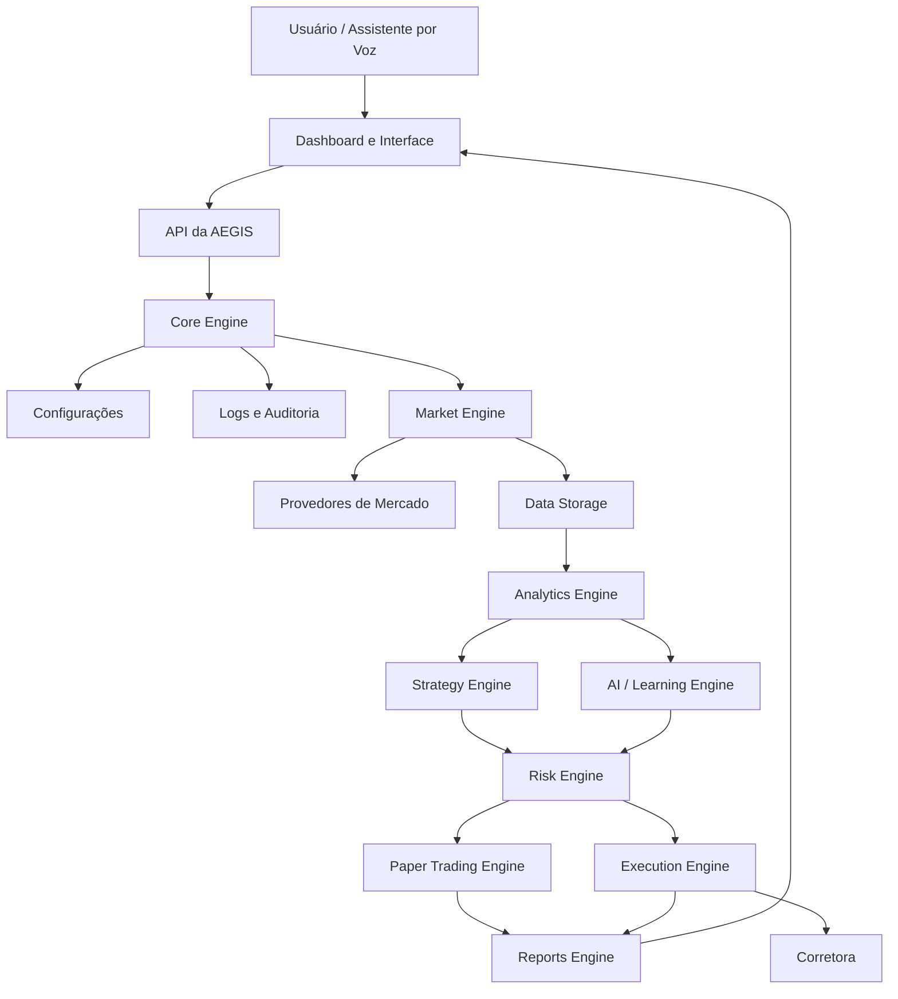
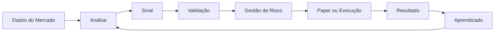

# Arquitetura da AEGIS

## 1. Visão geral

A AEGIS é uma plataforma modular para pesquisa, análise e automação no mercado financeiro.

O sistema será desenvolvido progressivamente, começando pela coleta de dados e evoluindo até paper trading, inteligência artificial e operação automatizada supervisionada.

O principal objetivo da arquitetura é permitir que cada módulo evolua sem comprometer os demais.

---

## 2. Princípios arquiteturais

A AEGIS seguirá estes princípios:

- Separação de responsabilidades
- Baixo acoplamento entre módulos
- Testes automatizados
- Configuração externa
- Registro completo por logs
- Validação antes da execução
- Gestão de risco independente da IA
- Paper trading antes de qualquer operação real
- Explicabilidade das decisões
- Evolução controlada dos modelos

---

## 3. Arquitetura geral



---

## 4. Módulos principais

### 4.1 Core Engine

Responsável pela inicialização e coordenação da plataforma.

Responsabilidades:

- iniciar a aplicação;
- carregar configurações;
- configurar logs;
- validar dependências;
- coordenar os módulos;
- encerrar o sistema com segurança.

Local planejado:

```text
src/core/
```

---

### 4.2 Market Engine

Responsável por obter dados do mercado.

Responsabilidades:

- consultar preços;
- baixar candles;
- consultar volume;
- receber dados em tempo real;
- integrar diferentes provedores;
- validar respostas externas.

Local planejado:

```text
src/market/
```

---

### 4.3 Data Storage

Responsável pela memória estrutural da AEGIS.

Responsabilidades:

- armazenar candles;
- armazenar operações;
- armazenar sinais;
- armazenar resultados;
- armazenar métricas dos modelos;
- recuperar dados históricos.

Local planejado:

```text
src/database/
```

Tecnologia planejada:

```text
PostgreSQL
```

---

### 4.4 Analytics Engine

Responsável por transformar dados brutos em informações úteis.

Responsabilidades:

- calcular indicadores;
- medir volatilidade;
- identificar tendências;
- detectar regimes de mercado;
- gerar métricas estatísticas;
- preparar dados para estratégias e IA.

Local planejado:

```text
src/analytics/
```

---

### 4.5 Strategy Engine

Responsável pelas estratégias tradicionais.

Responsabilidades:

- gerar sinais;
- executar regras;
- comparar estratégias;
- registrar motivos de entrada;
- registrar motivos de saída;
- informar nível de confiança.

Local planejado:

```text
src/strategies/
```

---

### 4.6 AI Engine

Responsável pelos modelos de inteligência artificial.

Responsabilidades:

- treinar modelos;
- gerar previsões;
- comparar versões;
- detectar mudanças no mercado;
- aprender com dados históricos;
- propor novas versões de modelos.

Local planejado:

```text
src/ai/
```

A IA não poderá colocar uma nova versão diretamente em produção.

Toda versão deverá passar por:

```text
Treinamento
    ↓
Backtest
    ↓
Validação
    ↓
Paper trading
    ↓
Aprovação
    ↓
Produção supervisionada
```

---

### 4.7 Risk Engine

Responsável pela proteção do capital.

Responsabilidades:

- limitar perda por operação;
- limitar perda diária;
- limitar exposição;
- definir tamanho da posição;
- bloquear operações;
- interromper o sistema;
- controlar drawdown.

Local planejado:

```text
src/risk/
```

O Risk Engine será independente da IA.

A IA poderá sugerir uma operação, mas o Risk Engine terá poder para recusá-la.

---

### 4.8 Backtesting Engine

Responsável pelos testes históricos.

Responsabilidades:

- reproduzir dados passados;
- simular estratégias;
- calcular custos;
- calcular lucro e prejuízo;
- medir drawdown;
- evitar vazamento de dados futuros;
- comparar estratégias.

Local planejado:

```text
src/backtesting/
```

---

### 4.9 Paper Trading Engine

Responsável pelas operações simuladas.

Responsabilidades:

- simular compra e venda;
- controlar saldo fictício;
- aplicar stop-loss;
- aplicar take-profit;
- registrar operações;
- simular taxas e slippage.

Local planejado:

```text
src/paper_trading/
```

---

### 4.10 Execution Engine

Responsável pelo envio de ordens reais.

Responsabilidades futuras:

- enviar ordens;
- cancelar ordens;
- consultar posições;
- validar execução;
- reconciliar ordens;
- detectar falhas da corretora.

Local planejado:

```text
src/execution/
```

Este módulo permanecerá desativado durante as fases iniciais.

---

### 4.11 Reports Engine

Responsável pelos relatórios.

Responsabilidades:

- resultado diário;
- resultado semanal;
- resultado mensal;
- taxa de acerto;
- profit factor;
- drawdown;
- melhor estratégia;
- pior estratégia;
- comparação entre modelos.

Local planejado:

```text
src/reports/
```

---

### 4.12 Voice Engine

Responsável pela interação por voz.

Responsabilidades futuras:

- reconhecer comandos;
- responder perguntas;
- explicar decisões;
- informar resultados;
- emitir alertas.

Local planejado:

```text
src/voice/
```

---

## 5. Fluxo de decisão



---

## 6. Regra de segurança

Nenhuma ordem poderá ser executada sem passar por:

```text
Estratégia ou IA
        ↓
Validação do sinal
        ↓
Risk Engine
        ↓
Verificação do modo de operação
        ↓
Paper Trading ou Execution Engine
```

A gestão de risco será obrigatória e não poderá ser ignorada por nenhum modelo.

---

## 7. Modos da plataforma

A AEGIS terá os seguintes modos:

### Research

Pesquisa e análise de dados.

### Backtest

Simulação com dados históricos.

### Paper Trading

Operação simulada em tempo real.

### Live Supervised

Operação real com supervisão humana.

### Live Automated

Operação automática dentro de limites rígidos.

O modo `Live Automated` será o último estágio do projeto.

---

## 8. Estrutura planejada

```text
src/
├── core/
├── market/
├── database/
├── analytics/
├── strategies/
├── ai/
├── risk/
├── backtesting/
├── paper_trading/
├── execution/
├── reports/
├── api/
├── dashboard/
├── voice/
└── main.py
```

As pastas serão criadas somente quando começarmos a implementar cada módulo.

---

## 9. Estado atual

Módulos implementados:

- Core básico
- Configurações JSON
- Validação de configurações
- Logs
- Testes automatizados
- Cliente inicial da Binance
- Coleta inicial de candles

Próximo objetivo:

> Transformar a coleta inicial da Binance em um Market Engine independente e testável.

---

## 10. Regra de evolução

Toda funcionalidade seguirá este fluxo:

```text
Planejamento
    ↓
Arquitetura
    ↓
Implementação
    ↓
Testes
    ↓
Documentação
    ↓
Commit
    ↓
Release
```